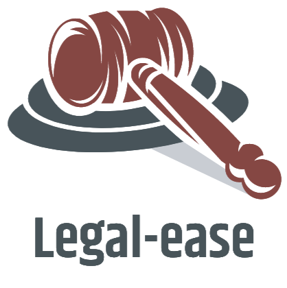
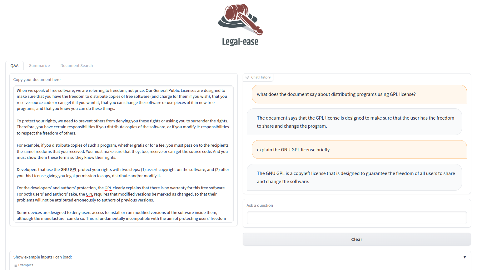

<p  align="center">



</p>  

# <p style="font-family:Droid Serif"><center>A suite of NLP tools to simplify legal documents</center></p>
  
  
### What do employment agreements, contracts, lease documents, patents and licenses have in common?
Apart from the fact that they're all legal documents:
1. They tend to have complex sentence structure and vocabulary choices that aren't accessible to people only familiar with conversational English
2. Are difficult to comprehend for non-native speakers of the language they are written in
3. Can run into several tens of pages (if not more)
  
  
## <font face="Trebuchet MS" color='maroon'>Legal-ease</font> addresses these issues using three tools:

1.  **QnA over legal documents**: Copy your document and ask it questions. Useful whether you have questions about the document as a whole or a specific clause.

2.  **Document summarization**: Generate a summary of the document. Options include changing the length of the summary (`small`, `medium` or `large`) and a choice between `paragraphs` or `bullets`. 

3.  **Multi & Cross-lingual document search**: Perform cross-lingual semantic search over a collection of legal documents. This is currently a showcase feature allowing the user to perform keyword as well as semantic search over a collection of COVID-19 pandemic legislative documents and returns the top-3 document matches. Also features the option to translate into other languages [currently English-only].
  
  
## **Installation:**

1. Create a free-tier Cohere account and set the COHERE_API_KEY environment variable.

2. Create a free-tier Qdrant cluster and set the following environment variables - QDRANT_API_KEY AND QDRANT_HOST.

3. Install requirements.

```
cd <project_dir>

conda create -n legal-ease --file requirements.txt

conda activate legal-ease
```
  
  
## **Usage**
In the project dir, run:
```
python gradio_demo.py
```

To run the app in reload mode:
```
gradio gradio_demo.py
```
 
The app should typically appear on the url: `http://localhost:7860`

<p  align="center">



</p>
  
  

## Tools & Technologies used:

1. **[Cohere](https://docs.cohere.ai/docs/the-cohere-platform)**: Cohere offers capability to add cutting-edge language processing to any system. They train large language models with API access. <font face="Trebuchet MS">Legal-ease</font> uses Cohere's `multilingual-22-12` model to obtain multilingual embeddings, the `summarize-xlarge` model for summarization and `command-xlarge-nightly` for question answering.

2.  **[Qdrant](https://qdrant.tech/)**: Qdrant is a vector similarity engine & vector database and comes with an API service for semantic search - searching for the nearest high-dimensional vectors. 

3.  **[Langchain](https://langchain.readthedocs.io/en/latest/getting_started/getting_started.html)**: It is an open source library that provides abstractions for building LLM-based applications

4.  **[Gradio](https://gradio.app/docs/)**: The frontend of the application is built using Gradio.

5. **[HF Spaces](https://huggingface.co/docs/hub/spaces-overview)**: Hugging Face Spaces offers deployment support for ML applications. [Here is the link to our space](https://huggingface.co/spaces/Legal-ease/legal-ease)
  
  
## References:

- [Langchain Question-Answering guide](https://langchain.readthedocs.io/en/latest/use_cases/question_answering.html)

- [MultiLingual Semantic Search using Cohere and Langchain](https://txt.cohere.ai/search-cohere-langchain/)

- [Q&A with Cohere and Qdrant](https://qdrant.tech/articles/qa-with-cohere-and-qdrant/)

- [Semantic Search Livestream with Cohere and Qdrant team organized by LabLab.ai](https://www.twitch.tv/videos/1764056911)
  
  
## Acknowledgements:

- We'd like to thank [Joel Niklaus](https://huggingface.co/joelito) for open-sourcing so many datasets and models related to the legal domain. We particularly found the [english_contracts_summarization](https://huggingface.co/datasets/joelito/plain_english_contracts_summarization) and [covid19_emergency_event](https://huggingface.co/datasets/joelito/covid19_emergency_event) datasets to be very useful for our project.
